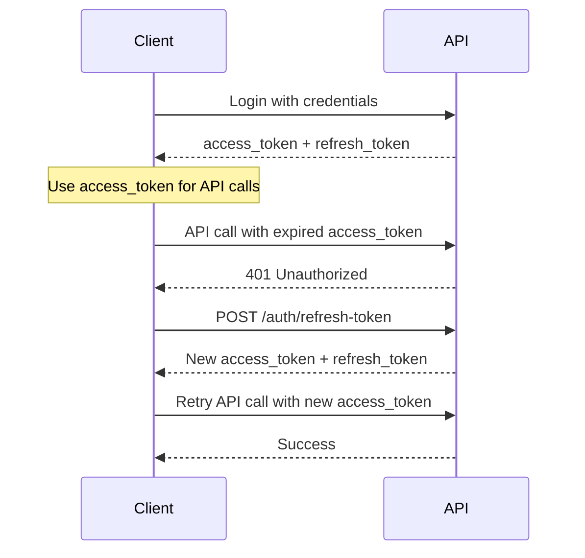

# NestJS Backend API Documentation

## Project Overview

This is a comprehensive NestJS backend application for a SaaS platform that provides task management, meeting scheduling, user management, and analytics features. The application uses MongoDB with Prisma ORM and implements JWT-based authentication with role-based access control.

## Technology Stack

- **Framework**: NestJS
- **Database**: MongoDB
- **ORM**: Prisma
- **Authentication**: JWT with custom guards
- **Validation**: class-validator
- **Language**: TypeScript

## Database Schema

The application uses the following main entities:

- **User**: User accounts with authentication and profile information
- **Organization**: Multi-tenant organization structure
- **Task**: Task management with assignments and status tracking
- **Meeting**: Meeting scheduling with participants
- **Notification**: User notifications system
- **ActivityLog**: Audit trail for user actions
- **MeetingParticipant**: Junction table for meeting attendees

## API Endpoints

### 1. Root Endpoints

#### GET /
- **Method**: GET
- **Description**: Health check endpoint
- **Authentication**: None
- **Payload**: None
- **Response**: "Hello World!" message
- **Related Files**:
  - `@/e:\New Projects\nest-backend\src\app.controller.ts:8-11`
  - `@/e:\New Projects\nest-backend\src\app.service.ts`

---

### 2. Authentication Endpoints (`/auth`)

#### POST /auth/signup
- **Method**: POST
- **Description**: Register a new user account
- **Authentication**: None
- **Payload**:
  ```json
  {
    "email": "string (email format)",
    "password": "string (min 8 characters)",
    "fullName": "string"
  }
  ```
- **Related Files**:
  - `@/e:\New Projects\nest-backend\src\auth\auth.controller.ts:17-20`
  - `@/e:\New Projects\nest-backend\src\auth\dto\signup.dto.ts`
  - `@/e:\New Projects\nest-backend\src\auth\auth.service.ts`

#### POST /auth/verify-email
- **Method**: POST
- **Description**: Verify user email with OTP
- **Authentication**: None
- **Payload**:
  ```json
  {
    "email": "string",
    "otp": "string"
  }
  ```
- **Response**:
  ```json
  {
    "access_token": "string",
    "refresh_token": "string",
    "expires_in": 1800,
    "user": {
      "id": "string",
      "fullName": "string",
      "email": "string",
      "avatarUrl": "string",
      "role": "string",
      "orgId": "string"
    }
  }
  ```
- **Related Files**:
  - `@/e:\New Projects\nest-backend\src\auth\auth.controller.ts:22-25`

#### POST /auth/signin
- **Method**: POST
- **Description**: User login
- **Authentication**: None
- **Payload**:
  ```json
  {
    "email": "string",
    "password": "string"
  }
  ```
- **Response**:
  ```json
  {
    "access_token": "string",
    "refresh_token": "string",
    "expires_in": 1800,
    "user": {
      "id": "string",
      "fullName": "string",
      "email": "string",
      "avatarUrl": "string",
      "role": "string",
      "orgId": "string"
    }
  }
  ```
- **Related Files**:
  - `@/e:\New Projects\nest-backend\src\auth\auth.controller.ts:27-30`

#### POST /auth/forgot-password
- **Method**: POST
- **Description**: Request password reset
- **Authentication**: None
- **Payload**:
  ```json
  {
    "email": "string"
  }
  ```
- **Related Files**:
  - `@/e:\New Projects\nest-backend\src\auth\auth.controller.ts:32-35`

#### POST /auth/reset-password
- **Method**: POST
- **Description**: Reset password with token
- **Authentication**: None
- **Payload**:
  ```json
  {
    "token": "string",
    "newPassword": "string"
  }
  ```
- **Related Files**:
  - `@/e:\New Projects\nest-backend\src\auth\auth.controller.ts:37-40`

#### POST /auth/resend-otp
- **Method**: POST
- **Description**: Resend email verification OTP
- **Authentication**: None
- **Payload**:
  ```json
  {
    "email": "string"
  }
  ```
- **Related Files**:
  - `@/e:\New Projects\nest-backend\src\auth\auth.controller.ts:41-44`

#### POST /auth/google
- **Method**: POST
- **Description**: Google OAuth authentication
- **Authentication**: None
- **Payload**:
  ```json
  {
    "idToken": "string"
  }
  ```
- **Response**:
  ```json
  {
    "access_token": "string",
    "refresh_token": "string", 
    "expires_in": 900,
    "user": {
      "id": "string",
      "fullName": "string",
      "email": "string",
      "avatarUrl": "string",
      "role": "string",
      "orgId": "string"
    }
  }
  ```
- **Related Files**:
  - `@/e:\New Projects\nest-backend\src\auth\auth.controller.ts:45-48`

#### POST /auth/refresh-token
- **Method**: POST
- **Description**: Generate new access token using refresh token
- **Authentication**: None
- **Payload**:
  ```json
  {
    "refresh_token": "string",
    "current_access_token": "string (optional)"
  }
  ```
- **Smart Refresh Logic**: 
  - If `current_access_token` is provided, API checks if it expires within 5 minutes
  - If token expires within 5 minutes or is already expired, new tokens are issued
  - If token is still valid for more than 5 minutes, no refresh is performed
- **Response** (when tokens are refreshed):
  ```json
  {
    "access_token": "string",
    "refresh_token": "string",
    "expires_in": 1800,
    "user": {
      "id": "string",
      "fullName": "string", 
      "email": "string",
      "avatarUrl": "string",
      "role": "string",
      "orgId": "string"
    }
  }
  ```
- **Response** (when no refresh needed):
  ```json
  {
    "message": "Token is still valid, no refresh needed",
    "expires_in": 1800
  }
  ```
- **Error Responses**:
  - `401 Unauthorized`: Invalid or expired refresh token
- **Related Files**:
  - `@/e:\New Projects\nest-backend\src\auth\auth.controller.ts:52-55`
  - `@/e:\New Projects\nest-backend\src\auth\dto\refresh-token.dto.ts`

#### GET /auth/me
- **Method**: GET
- **Description**: Get current user profile
- **Authentication**: Required (CustomAuthGuard)
- **Payload**: None
- **Response**: Current user object
- **Related Files**:
  - `@/e:\New Projects\nest-backend\src\auth\auth.controller.ts:51-55`
  - `@/e:\New Projects\nest-backend\src\auth\guards\auth.guard.ts`

---

### 3. User Management Endpoints (`/users`)

#### POST /users
- **Method**: POST
- **Description**: Create a new user
- **Authentication**: None
- **Payload**:
  ```json
  {
    "email": "string",
    "passwordHash": "string",
    "fullName": "string",
    "avatarUrl": "string (optional)",
    "role": "string (optional)",
    "department": "string (optional)",
    "status": "string (optional)"
  }
  ```
- **Related Files**:
  - `@/e:\New Projects\nest-backend\src\users\users.controller.ts:9-12`
  - `@/e:\New Projects\nest-backend\src\users\dto\create-user.dto.ts`

#### GET /users
- **Method**: GET
- **Description**: Get all users
- **Authentication**: None
- **Payload**: None
- **Related Files**:
  - `@/e:\New Projects\nest-backend\src\users\users.controller.ts:14-17`

#### GET /users/:id
- **Method**: GET
- **Description**: Get user by ID
- **Authentication**: None
- **Payload**: None
- **Parameters**: `id` (string) - User ID
- **Related Files**:
  - `@/e:\New Projects\nest-backend\src\users\users.controller.ts:19-22`

#### PATCH /users/:id
- **Method**: PATCH
- **Description**: Update user by ID
- **Authentication**: None
- **Payload**: Partial user object (same as CreateUserDto but all fields optional)
- **Parameters**: `id` (string) - User ID
- **Related Files**:
  - `@/e:\New Projects\nest-backend\src\users\users.controller.ts:24-27`
  - `@/e:\New Projects\nest-backend\src\users\dto\update-user.dto.ts`

#### DELETE /users/:id
- **Method**: DELETE
- **Description**: Delete user by ID
- **Authentication**: None
- **Payload**: None
- **Parameters**: `id` (string) - User ID
- **Related Files**:
  - `@/e:\New Projects\nest-backend\src\users\users.controller.ts:29-32`

---

### 4. Task Management Endpoints (`/api/tasks`)

All task endpoints require authentication (CustomAuthGuard).

#### POST /api/tasks
- **Method**: POST
- **Description**: Create a new task
- **Authentication**: Required (CustomAuthGuard)
- **Payload**:
  ```json
  {
    "title": "string",
    "description": "string (optional)",
    "date": "string (optional, UTC zone)",
    "dueDate": "string (optional, UTC format)",
    "priority": "low | medium | high (optional)",
    "status": "todo | in-progress | completed (optional)",
    "blocker": "string (optional, e.g., 'Waiting for approval')",
    "assignedTo": "string (optional, MongoDB ObjectId)"
  }
  ```
- **Related Files**:
  - `@/e:\New Projects\nest-backend\src\tasks\tasks.controller.ts:11-14`
  - `@/e:\New Projects\nest-backend\src\tasks\dto\create-task.dto.ts`

#### GET /api/tasks
- **Method**: GET
- **Description**: Get all tasks with optional filtering
- **Authentication**: Required (CustomAuthGuard)
- **Query Parameters**:
  - `status` (optional): Filter by task status
  - `priority` (optional): Filter by task priority
  - `page` (optional): Page number for pagination
  - `limit` (optional): Number of items per page
- **Payload**: None
- **Related Files**:
  - `@/e:\New Projects\nest-backend\src\tasks\tasks.controller.ts:16-24`

#### GET /api/tasks/:id
- **Method**: GET
- **Description**: Get task by ID
- **Authentication**: Required (CustomAuthGuard)
- **Payload**: None
- **Parameters**: `id` (string) - Task ID
- **Related Files**:
  - `@/e:\New Projects\nest-backend\src\tasks\tasks.controller.ts:26-29`

#### POST /api/tasks/update
- **Method**: POST
- **Description**: Update task by ID
- **Authentication**: Required (CustomAuthGuard)
- **Payload**: taskId is required along with any fields to update:
  ```json
  {
    "taskId": "string (required, MongoDB ObjectId)",
    "title": "string (optional)",
    "description": "string (optional)",
    "date": "string (optional, UTC zone)",
    "dueDate": "string (optional, UTC format)",
    "priority": "low | medium | high (optional)",
    "status": "todo | in-progress | completed (optional)",
    "blocker": "string (optional, e.g., 'Waiting for approval')",
    "assignedTo": "string (optional, MongoDB ObjectId)"
  }
  ```
- **Related Files**:
  - `@/e:\New Projects\nest-backend\src\tasks\tasks.controller.ts:32-35`
  - `@/e:\New Projects\nest-backend\src\tasks\dto\update-task.dto.ts`

#### POST /api/tasks/delete
- **Method**: POST
- **Description**: Delete task by ID
- **Authentication**: Required (CustomAuthGuard)
- **Payload**:
  ```json
  {
    "taskId": "string (required, MongoDB ObjectId)"
  }
  ```
- **Related Files**:
  - `@/e:\New Projects\nest-backend\src\tasks\tasks.controller.ts:37-40`

---

### 5. Meeting Management Endpoints (`/api/meetings`)

All meeting endpoints require authentication (CustomAuthGuard).

#### POST /api/meetings
- **Method**: POST
- **Description**: Create a new meeting
- **Authentication**: Required (CustomAuthGuard)
- **Payload**:
  ```json
  {
    "title": "string",
    "description": "string (optional)",
    "startTime": "string (ISO date)",
    "endTime": "string (ISO date)",
    "meetingLink": "string (optional, URL)",
    "status": "string",
    "isRecurring": "boolean (optional)"
  }
  ```
- **Related Files**:
  - `@/e:\New Projects\nest-backend\src\meetings\meetings.controller.ts:11-14`
  - `@/e:\New Projects\nest-backend\src\meetings\dto\create-meeting.dto.ts`

#### GET /api/meetings
- **Method**: GET
- **Description**: Get all meetings for the authenticated user
- **Authentication**: Required (CustomAuthGuard)
- **Payload**: None
- **Related Files**:
  - `@/e:\New Projects\nest-backend\src\meetings\meetings.controller.ts:16-19`

#### GET /api/meetings/:id
- **Method**: GET
- **Description**: Get meeting by ID
- **Authentication**: Required (CustomAuthGuard)
- **Payload**: None
- **Parameters**: `id` (string) - Meeting ID
- **Related Files**:
  - `@/e:\New Projects\nest-backend\src\meetings\meetings.controller.ts:21-24`

#### PUT /api/meetings/:id
- **Method**: PUT
- **Description**: Update meeting by ID
- **Authentication**: Required (CustomAuthGuard)
- **Payload**: Meeting update object
- **Parameters**: `id` (string) - Meeting ID
- **Related Files**:
  - `@/e:\New Projects\nest-backend\src\meetings\meetings.controller.ts:26-29`

#### DELETE /api/meetings/:id
- **Method**: DELETE
- **Description**: Delete meeting by ID
- **Authentication**: Required (CustomAuthGuard)
- **Payload**: None
- **Parameters**: `id` (string) - Meeting ID
- **Related Files**:
  - `@/e:\New Projects\nest-backend\src\meetings\meetings.controller.ts:31-34`

#### POST /api/meetings/:id/join
- **Method**: POST
- **Description**: Join a meeting
- **Authentication**: Required (CustomAuthGuard)
- **Payload**: None
- **Parameters**: `id` (string) - Meeting ID
- **Related Files**:
  - `@/e:\New Projects\nest-backend\src\meetings\meetings.controller.ts:36-39`

---

### 6. Organization Management Endpoints (`/api/organizations`)

All organization endpoints require authentication (CustomAuthGuard).

#### POST /api/organizations
- **Method**: POST
- **Description**: Create a new organization
- **Authentication**: Required (CustomAuthGuard)
- **Payload**:
  ```json
  {
    "name": "string"
  }
  ```
- **Related Files**:
  - `@/e:\New Projects\nest-backend\src\organizations\organizations.controller.ts:10-13`

#### GET /api/organizations/me
- **Method**: GET
- **Description**: Get current user's organization
- **Authentication**: Required (CustomAuthGuard)
- **Payload**: None
- **Related Files**:
  - `@/e:\New Projects\nest-backend\src\organizations\organizations.controller.ts:15-18`

---

### 7. Notification Endpoints (`/api/notifications`)

All notification endpoints require authentication (CustomAuthGuard).

#### GET /api/notifications
- **Method**: GET
- **Description**: Get all notifications for the authenticated user
- **Authentication**: Required (CustomAuthGuard)
- **Payload**: None
- **Related Files**:
  - `@/e:\New Projects\nest-backend\src\notifications\notifications.controller.ts:10-14`

#### PUT /api/notifications/:id/read
- **Method**: PUT
- **Description**: Mark notification as read
- **Authentication**: Required (CustomAuthGuard)
- **Payload**: None
- **Parameters**: `id` (string) - Notification ID
- **Related Files**:
  - `@/e:\New Projects\nest-backend\src\notifications\notifications.controller.ts:16-19`

#### DELETE /api/notifications/:id
- **Method**: DELETE
- **Description**: Delete notification by ID
- **Authentication**: Required (CustomAuthGuard)
- **Payload**: None
- **Parameters**: `id` (string) - Notification ID
- **Related Files**:
  - `@/e:\New Projects\nest-backend\src\notifications\notifications.controller.ts:21-24`

---

### 8. Analytics Endpoints (`/api/analytics`)

All analytics endpoints require authentication (CustomAuthGuard and RolesGuard).

#### GET /api/analytics/dashboard
- **Method**: GET
- **Description**: Get dashboard analytics summary
- **Authentication**: Required (CustomAuthGuard + RolesGuard)
- **Query Parameters**:
  - `from` (optional): Start date for analytics
  - `to` (optional): End date for analytics
- **Payload**: None
- **Related Files**:
  - `@/e:\New Projects\nest-backend\src\analytics\analytics.controller.ts:12-24`

#### GET /api/analytics/tasks
- **Method**: GET
- **Description**: Get task analytics
- **Authentication**: Required (CustomAuthGuard + RolesGuard)
- **Payload**: None
- **Related Files**:
  - `@/e:\New Projects\nest-backend\src\analytics\analytics.controller.ts:26-29`

#### GET /api/analytics/meetings
- **Method**: GET
- **Description**: Get meeting analytics
- **Authentication**: Required (CustomAuthGuard + RolesGuard)
- **Payload**: None
- **Related Files**:
  - `@/e:\New Projects\nest-backend\src\analytics\analytics.controller.ts:31-37`

#### GET /api/analytics/admin/user-activity
- **Method**: GET
- **Description**: Get user activity analytics (Admin only)
- **Authentication**: Required (CustomAuthGuard + RolesGuard + Admin role)
- **Payload**: None
- **Related Files**:
  - `@/e:\New Projects\nest-backend\src\analytics\analytics.controller.ts:40-45`
  - `@/e:\New Projects\nest-backend\src\auth\decorators\roles.decorator.ts`

---

### 9. Activity Logs Endpoints (`/api/activity-logs`)

All activity log endpoints require authentication (CustomAuthGuard and RolesGuard).

#### GET /api/activity-logs
- **Method**: GET
- **Description**: Get activity logs for the authenticated user
- **Authentication**: Required (CustomAuthGuard + RolesGuard)
- **Payload**: None
- **Related Files**:
  - `@/e:\New Projects\nest-backend\src\activity-logs\activity-logs.controller.ts:11-14`

---

## Authentication & Authorization

### JWT Token Management

The application uses a dual-token authentication system for enhanced security:

#### Token Types

1. **Access Token**
   - **Purpose**: Used for API authentication
   - **Expiry**: 30 minutes (balanced security and user experience)
   - **Usage**: Include in Authorization header: `Bearer <access_token>`
   - **Refresh**: Use refresh token to get new access token

2. **Refresh Token**
   - **Purpose**: Used to obtain new access tokens
   - **Expiry**: 7 days (longer-lived)
   - **Usage**: Send to `/auth/refresh-token` endpoint
   - **Security**: Should be stored securely (httpOnly cookies recommended)

#### Token Refresh Flow



#### Frontend Implementation Example

```javascript
// Store tokens securely
localStorage.setItem('access_token', response.access_token);
localStorage.setItem('refresh_token', response.refresh_token);

// Smart refresh function that checks token expiry
async function refreshTokenIfNeeded() {
  const accessToken = localStorage.getItem('access_token');
  const refreshToken = localStorage.getItem('refresh_token');
  
  if (!refreshToken) {
    throw new Error('No refresh token available');
  }

  try {
    const response = await axios.post('/auth/refresh-token', {
      refresh_token: refreshToken,
      current_access_token: accessToken // Optional: for smart refresh
    });
    
    if (response.data.access_token) {
      // Update stored tokens with new ones
      localStorage.setItem('access_token', response.data.access_token);
      localStorage.setItem('refresh_token', response.data.refresh_token);
      return response.data.access_token;
    } else {
      // Token is still valid, no refresh needed
      return accessToken;
    }
  } catch (error) {
    // Refresh failed, clear tokens and redirect to login
    localStorage.removeItem('access_token');
    localStorage.removeItem('refresh_token');
    window.location.href = '/login';
    throw error;
  }
}

// API interceptor for automatic token refresh
axios.interceptors.response.use(
  (response) => response,
  async (error) => {
    if (error.response?.status === 401) {
      try {
        const newAccessToken = await refreshTokenIfNeeded();
        
        // Retry original request with new token
        error.config.headers.Authorization = `Bearer ${newAccessToken}`;
        return axios.request(error.config);
      } catch (refreshError) {
        // Refresh failed, let the error propagate
        return Promise.reject(refreshError);
      }
    }
    return Promise.reject(error);
  }
);

// Proactive refresh: Check token before making important requests
async function makeApiCallWithRefresh(config) {
  const accessToken = localStorage.getItem('access_token');
  
  // Optional: Decode token to check expiry (requires jwt-decode library)
  try {
    const decoded = jwt_decode(accessToken);
    const timeUntilExpiry = decoded.exp - Math.floor(Date.now() / 1000);
    const fiveMinutesInSeconds = 5 * 60;
    
    // If token expires within 5 minutes, refresh it first
    if (timeUntilExpiry <= fiveMinutesInSeconds) {
      await refreshTokenIfNeeded();
    }
  } catch (decodeError) {
    // If we can't decode, try refresh anyway
    await refreshTokenIfNeeded();
  }
  
  // Make the API call with current token
  return axios(config);
}
```

#### Security Best Practices

1. **Access Token Storage**: Store in memory or secure storage (avoid localStorage for production)
2. **Refresh Token Storage**: Use httpOnly cookies or secure storage
3. **Token Rotation**: New refresh token issued with each refresh (implemented)
4. **Automatic Refresh**: Implement interceptors to handle token refresh automatically
5. **Logout**: Clear both tokens and invalidate sessions

### Authentication Guards

1. **CustomAuthGuard**: JWT-based authentication guard
   - File: `@/e:\New Projects\nest-backend\src\auth\guards\auth.guard.ts`
   - Validates JWT tokens and extracts user information

2. **RolesGuard**: Role-based access control guard
   - File: `@/e:\New Projects\nest-backend\src\auth\guards\roles.guard.ts`
   - Checks user roles for protected endpoints

### Role-based Access

- **Admin Role**: Required for admin-specific analytics endpoints
- **User Role**: Default role for regular users
- Roles are defined in the User model and checked via the `@Roles()` decorator

## Project Structure

```
src/
├── activity-logs/          # Activity logging module
├── analytics/              # Analytics and reporting module
├── auth/                   # Authentication and authorization
│   ├── dto/               # Data transfer objects
│   ├── guards/            # Authentication guards
│   └── decorators/        # Custom decorators
├── common/                 # Shared utilities and interceptors
│   ├── filters/           # Exception filters
│   └── interceptors/      # Response interceptors
├── gateways/              # WebSocket gateways
├── mail/                  # Email service module
├── meetings/              # Meeting management module
├── notifications/         # Notification system module
├── organizations/         # Organization management module
├── prisma/                # Prisma ORM configuration
├── tasks/                 # Task management module
├── users/                 # User management module
├── app.module.ts          # Main application module
└── main.ts               # Application entry point
```

## Key Features

1. **Multi-tenant Architecture**: Organization-based data isolation
2. **JWT Authentication**: Secure token-based authentication
3. **Role-based Access Control**: Admin and user role separation
4. **Email Verification**: OTP-based email verification system
5. **Password Reset**: Secure password reset with tokens
6. **Google OAuth**: Social login integration
7. **Real-time Features**: WebSocket support for real-time updates
8. **Activity Logging**: Comprehensive audit trail
9. **Analytics Dashboard**: Business intelligence and reporting
10. **Notification System**: User notification management

## Response Format

All API responses follow a consistent format using the TransformInterceptor:

```json
{
  "success": true,
  "data": {}, // Response data
  "message": "Success message",
  "timestamp": "2024-01-01T00:00:00.000Z"
}
```

Error responses:

```json
{
  "success": false,
  "error": {
    "message": "Error message",
    "statusCode": 400
  },
  "timestamp": "2024-01-01T00:00:00.000Z"
}
```

## Environment Configuration

The application requires the following environment variables:

- `DATABASE_URL`: MongoDB connection string
- `JWT_SECRET`: Secret key for JWT token signing
- `FRONTEND_URL`: Frontend application URL for CORS
- `PORT`: Application port (default: 4000)
- Email service configuration for OTP and password reset
- Google OAuth configuration for social login

## How It Works

1. **Application Bootstrap**: The application starts from `main.ts`, setting up global pipes, filters, and interceptors
2. **Module System**: NestJS modules organize features into cohesive units
3. **Database Layer**: Prisma ORM handles database operations with MongoDB
4. **Authentication Flow**: JWT tokens are issued on login and validated on protected routes
5. **Authorization**: Role-based guards control access to sensitive endpoints
6. **Data Validation**: DTOs with class-validator ensure data integrity
7. **Error Handling**: Global exception filters provide consistent error responses
8. **Response Transformation**: Global interceptors standardize API responses
